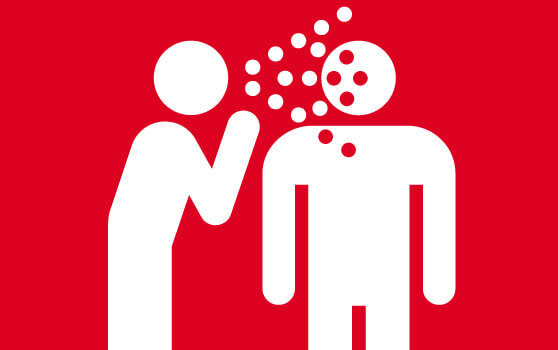

## Entrega 2 - ORM HIBERNATE

## De vuelta con los científicos del laboratorio

Triunfantes y llenos de algarabía, luego de haber cumplido todos y cada uno de los minuciosos requerimientos que los científicos les habían impuesto, vuelven al laboratorio donde se encuentran con una situación tanto particular.

Caos y desorden por todos lados, científicos corriendo de un lado a otro llevando torres de papelerio de aquí allá; Profesionales en batas blancas desplomados sobre sus escritorios por el cansancio; Vasitos de plástico tirados en el piso, aun mojados con café.

Un científico con los ojos algo cansados y con un guante negro que tapa todo su brazo derecho se les acerca para bienvenirlos y comentarles que desde la última entrega, han estado trabajando sin parar con la simulación y realizando descubrimientos realmente importantes.

Sin dejarlos ni siquiera contestar y con un movimiento brusco, los empuja hacia la sala de proyecciones, donde el científico si bien cansado, comienza a compartir su conocimiento de forma muy entusiasmada. Esto para ustedes solo significa una cosa.... más requerimientos.

## Cambios desde el TP anterior

Se identificaron una serie de cambios necesarios a hacerse sobre la prueba de concepto anterior:
La capa de persistencia deberá cambiarse para utilizar Hibernate/JPA en lugar de JDBC.
**Nota:** No es necesario que mantengan los test y funcionalidad utilizando JDBC.

## Funcionalidad

  

Una vez en la sala de proyectores, los cientificos profundizan contándonos más sobre esta suerte de patogenos biomecanicos, las cuales nos interesan por los atributos que los caracterizan.

### Atributos

- Capacidad de contagio, que puede ser por persona, animales o insectos.
- Defensa contra otros micro-organismos
- Capacidad de biomecanizacion, cual es el grado con el que convierte la carne y materia biologica del infectado en componentes mecanizados.
Una capacidad baja puede resultar en el remplazo del cabello por hilos de cobre. Una capacidad alta puede resultar en todo el cuerpo convirtiendose en una masa de cables, tubos y y compnentes mecanizados sin similutd alguna a un humano. 

Cada uno de estas atributos representa con un valor numérico del 1 al 100.

### Vectores

  

Les enseñan que un patógeno se esparce a través de vectores, que son los agentes que transportan y transmiten un patógeno a otro organismo vivo. 

Estos pueden ser Humanos, Animales, o Insectos.

### Ubicación

Los vectores pueden moverse de ubicación en ubicación.
Toda ubicación tendrá un nombre que deberá ser único.

### Contagio

Un vector podrá poner en riesgo de contagio a otro vector respetando las siguientes normas:

- Un humano puede ser contagiado por otro humano, un insecto o un animal.
- Un animal solo puede ser contagiado por un insecto.
- Un insecto solo puede ser contagiado por un humano o un animal.

La probabilidad que un contagio de un vector a otro sea exitoso se resolverá de la siguiente forma.
Tiene como base un número entre el 1 y el 10
A Este número se le suma el atributo de contagio de la especie relacionado al vector que se está intentando infectar  
Esto se traduce a:

`porcentajeDeContagioExitoso = (random(1, 10)) + capacidadDeContagio`

Con este porcentaje, deberá determinarse si el contagio fue exitoso o no. Si lo fue, el nuevo vector pasa de estar Sano a estar Infectado.

**Nota:** Un vector puede estar infectado por varias especies de patógenos.

## Servicios

Se pide que implementen los siguientes servicios los cuales serán consumidos por el frontend de la aplicación.

### VectorService

- `Crear, Recuperar y Recuperar todos`

- `infectar(vectorId: Long, especieId: Long)`  Se infecta al vector con la especie

- `enfermedades(vectorId: Long): List<Especie> `  Dado un vector retorna todas las especies que esta padeciendo.

### UbicacionService

- `Crear, Recuperar y Recuperar todos`

- `mover(vectorId: Long, ubicacionId: Long)` Mueve un vector de la ubicación en la que se encontraba a una nueva. Si el vector está infectado, intentara contagiar a todos los vectores presentes en la nueva locación. **Nota:** Leer VectorService.

- `expandir( ubicacionId: Long)` Dada una ubicación, deberá tomar un vector contagiado **elegido al azar**. Ese vector debe intentar contagiar a todos los otros vectores presentes en el mismo lugar. De no haber ningún vector contagiado en el lugar, no hace nada. **Nota:** Leer VectorService

### PatogenoService

- `Crear, Recuperar y Recuperar todos`

- `agregarEspecie(patogenoid: Long, nombreEspecie: String, ubicacionId: Long) : Especie` - Deberá lograr que se genere una nueva Especie del Patogeno, e infectar a un vector al azar en la ubicacion dada. Si no hay ningun vector en dicha ubicacion, lanzar una excepcion.

- `especiesDePatogeno(patogenoId: Long ): List<Especie>` devuelve las especies del patogeno

- `esPandemia(especieId: Long): Boolean` Devuelve true si la especie se encuentra presente más de la mitad de todas las locaciones disponibles

### EspecieService

- `Recuperar y Recuperar todos`

- `cantidadDeInfectados(especieId: Long ): Int` devuelve la cantidad de vectores infectados por la especie

### EstadisticaService

- `especieLider(): Especie` retorna la especie que haya infectado a más humanos

- `lideres(): List<Espceie>` retorna las diez primeras especies que hayan infecatado la mayor cantidad total de vectores humanos y animales combinados en orden descendente.

- `reporteDeContagios(nombreDeLaUbicacion: String): ReporteDeContagios` Dada una ubicacion, debera retornar un objeto reporte que contenga
    - La cantidad de vectores presentes.
    - Cantidad de vectores infectados.
    - Nombre de la especie que esta infectando a mas vectores.

### Se pide:

- Que provean implementaciónes para las interfaces descriptas anteriormente.

- Que modifiquen el mecanismo de persistencia de Patógeno de forma de que todo el modelo persistente utilice Hibernate.

- Asignen propiamente las responsabilidades a todos los objetos intervinientes, discriminando entre servicios, DAOs y objetos de negocio.

- Creen test que prueben todas las funcionalidades pedidas, con casos favorables y desfavorables.

- Que los tests sean determinísticos. Hay mucha lógica que depende del resultado de un valor aleatorio. Se aconseja no utilizar directamente generadores de valores aleatorios (random) sino introducir una interfaz en el medio para la cual puedan proveer una implementación mock determinística en los tests.

### Recuerden que:
- No pueden modificar las interfaces ya provistas en el TP, solo implementarlas.
- Pueden agregar nuevos métodos y atributos a los objetos ya provistos, pero no eliminar o renombrar atributos / métodos ya provistos.

### Consejos útiles:

- Finalicen los métodos de los services de uno en uno. Que quiere decir esto? Elijan un service, tomen el método más sencillo que vean en ese service, y encárguense de desarrollar la capa de modelo, de servicios y persistencia solo para ese único método. Una vez finalizado (esto también significa testeado), pasen al próximo método y repitan.

- Cuando tengan que persistir con hibernate, analicen:
  Qué objetos deben ser persistentes y cuáles no?
  Cuál es la cardinalidad de cada una de las relaciones? Como mapearlas?
