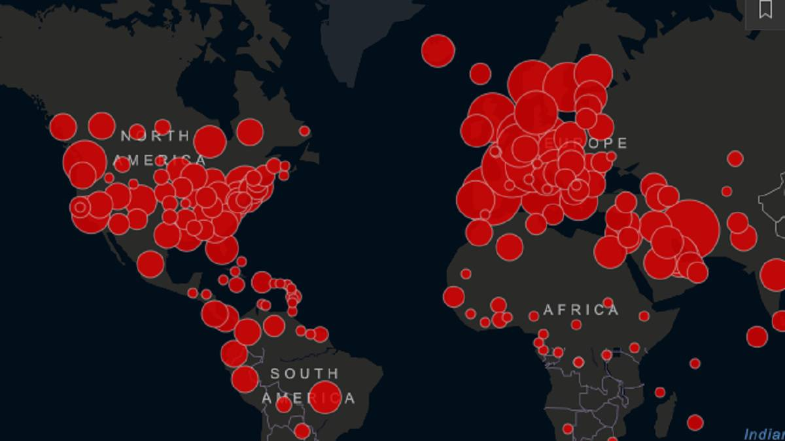

Fue una semana agotadora de labor sin descanso, de noches aciagas donde la cordura se desvanecía lentamente, azotada por las escalofriantes visiones que habian contemplado en aquel tenebroso cuarto del laboratorio en que las mutaciones eran manipuladas y confinadas en prisiones de cristal.

Exhaustos pero avivados por la satisfacción del deber cumplido, se reunen con su equipo de desarollo y se adentran una vez más en el lóbrego laboratorio, esperando obtener nuevos requerimientos de los cientificos para continuar con la fatidica simulacion.

Inmediatamente al pisar el umbral, pueden sentir algo siniestro en el ambiente. Cuando ustedes se acercan, los cientificos se corren a un lado, evitan su mirada, pero ustedes elijen no darle importancia y encaminan directo a la sala de proyecciones donde el científico amable de guante negro y mirada cansada solía recibirlos. Sin embargo, al llegar, encuentran únicamente a su asistente, quien como los demás, se lo nota algo nervioso.

Sin darles tiempo de hacer indagaciones, el asistente comienza con una perorata algo apurada en la cual les presenta sus nuevos requerimientos, e inmediatamente luego de terminar los instiga casi empujandolos a que abandonen el laboratorio y se pongan en marcha.

No estan tan seguros que es lo que esta sucediendo en el laboratorio, pero algo huele mal. Antes de salir por la puerta principal, vislumbran por el rabillo del ojo la entrada del cuarto de las prisiones de cristal; pueden ver que un líquido viscoso y oscuro se desliza por debajo de la puerta.

## Entrega 4 - NoSQL - Neo4J

  

Como bien habíamos aprendido, en nuestro sistema existen las ubicaciones. Todo vector tiene actualmente una ubicación y es posible que los vectores se muevan de ubicación en ubicación.
Los del laboratorio sin embargo, les dicen que la representación actual del concepto de ubicaciones se queda corto, y necesitan ampliar un poco su definición y comportamiento.

### Movimiento
 
Es poco real que los vectores se esten moviendo de una ubicación a otra ubicación sin restricción, casi como si pudieran teletransportarse.  Para hacernos cargo de esta irregularidad, se nos confía el modelado más real de ubicaciones.

En un principio, las ubicaciones deberían estar conectadas entre sí por medio de un camino, y un vector que necesite ser movido sólo debería poder moverse a una ubicación conectada a la ubicación donde está.

Los caminos se categorizan en tres tipos:

- Caminos terrestres : Que pueden ser atravesados por todos los tipos de vectores
- Caminos marítimos: Que pueden ser atravesados por humanos y animales
- Caminos aéreos: Que solo pueden ser atravesados por insectos y animales.

  

## Servicios

Se deberan realizar las siguientes modificaciones al `UbicacionService`:

- El mensaje `mover`  deberá ser reimplementado de forma de que:
	- Arroje una excepción `UbicacionMuyLejana` si no es posible llegar desde la actual ubicación del vector a la nueva por medio de un camino.
	- Arrojar una excepción `UbicacionNoAlcanzable` si se intenta mover a un vector a través de un tipo de camino que no puede atravesar.

- El mensaje `crearUbicacion` deberá ser re-implementado de tal forma que cree la ubicación tanto en hibernate como en Neo4j.

- Se deberá implementar el metodo `conectar(nombreDeUbicacion1:String, nombreDeUbicacion2:String, tipoCamino:String)` que conecte dos ubicaciones (se asumen preexistentes) por medio de un tipo de camino. Desde la ubicacion 1, a la ubicacion 2.

- Se deberá implementar el metodo `conectados(nombreDeUbicacion:String): List<Ubicacion>` que dado el nombre de una ubicacion, retorne todas las ubicaciones conectadas por cualquier tipo de camino desde la ubicacion dada. En otras palabras: Los diferentes caminos que un vector tendria la posibilidad de elegir a la hora de moverse de la ubicacion provista.
 
- Se deberá crear un mensaje `moverMasCorto(vectorId:Long, nombreDeUbicacion:String)` que funcione como el mover, pero que el vector intente llegar a la ubicación dada en la menor cantidad de movimientos.
Hay que tener en cuenta que:
			-No todos los tipos de vectores pueden moverse por los mismos tipos de caminos.
			-De no poder llegar de ninguna forma a la ubicacion destino se debera lanzar la excepcion `UbicionNoAlcanzable`

### Se pide:
- Que ademas de modificar el UbicacionService, tambien Modifiquen el UbicacionController para que se puedan realizar las llamadas al service desde el front.
- El objetivo de esta entrega es implementar los requerimientos utilizando una base de datos orientada a grafos.
- Creen test unitarios para cada unidad de código entregada que prueben todas las funcionalidades pedidas, con casos favorables y desfavorables.

### Recuerden que:
- Los caminos no son bidireccionales. Todo camino tiene una dirección. Los caminos bidireccionales serán sencillamente modelados como dos caminos en direcciones opuestas.
