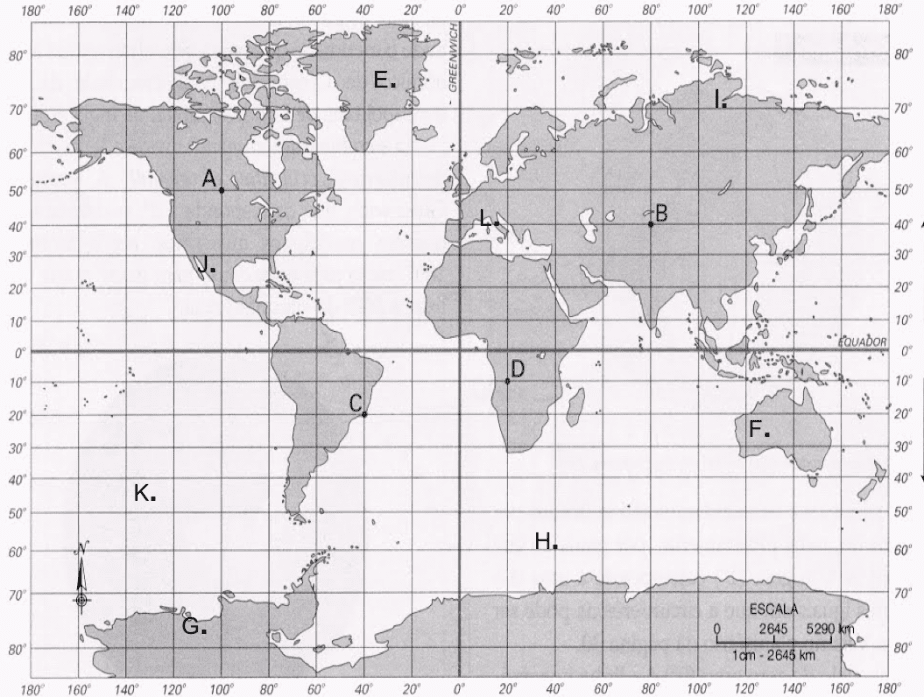
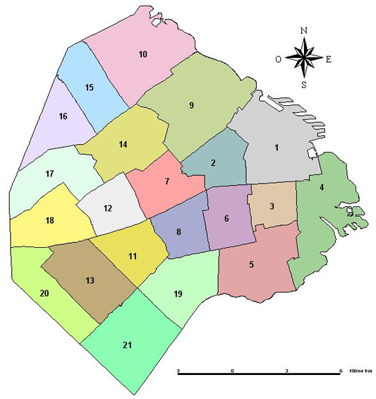
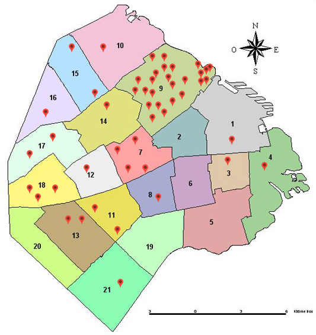

## Entrega 5 - No-SQL - MongoDB

Una vez mas, a las sombras de mi fatigada existencia, envuelto en un cuarto sombrío, me hundo en la labor de forjar la simulación.
Llevando ya semanas sin descanso, las horas escapan en un mar turbulento de código y diagramas. 
Escribo y codeo, abstrayendo el lenguaje binario en líneas de poder. Pongo a prueba comportamientos, testeo cada unidad integrando los fragmentos de una realidad artificial. Actualizo, copio, pego y consulto la vastedad digital, mientras corro test tras test, persiguiendo la elusiva solución que desbloquee el progreso y abra las puertas del éxtasis liberador del codigo compilado, una liberación ultimamente forzada por aquellos condenados a su propia arrogancia; los roedores del laboratorio que juegan a ser dioses.

Con los dedos cubiertos de llagas por las horas de tecleo desenfrenado, mi frente empapada en sudor y los ojos inyectados en sangre sin siquiera parpadear, dejo que mis manos se alejen del teclado por un instante, permitiendo que la realidad se haga presente, una realizacion que conocía pero que reprimía con vehemencia.

Los experimentos del cuarto con prisiones de cristal, la extraña desaparicion del lider cientifico, aquel liquido negruzco escapandose debajo de una de las puertas del laboratorio. La simulación no estaba siendo utilizada para combatir la amenaza bioquímica sino para fomentarla, preparando a la humanidad para dar el siguiente paso en esta macabra danza evolutiva. Y yo aqui, cual peon sin posibilidad otra que avanzar este terrible juego de ajedrez.

Desde la penumbra, las sombras de los científicos del laboratorio acechan, avanzando sigilosamente, exigiendo que continúe tecleando... suplicando... por más.

## Coordenadas

  

Se nos pide que terminemos de modelar nuestra representación de ubicaciones agregándoles coordenadas a las mismas.

Una coordenada es un par de números (latitud y longitud) que representan un punto en un plano que, en nuestro caso, sería la tierra llevada a un modelo "plano".

## Distritos

  

Las ubicaciones tienen una coordenada en particular, son un punto dentro de nuestro plano. Pero nos interesará también modelar áreas dentro de nuestro modelo, las cuales llamaremos "Distritos" y estarán representadas por varias coordenadas que le dan su forma, además de un nombre con el cual podremos referirnos a ellas.

### Cambios en el modelo

Se deberá modificar el método "Mover" de tal forma que también se levante la excepción `UbicacionMuyLejana` si las ubicaciones están a más de 100 kilómetros de distancia una de la otra.

De tal forma, cuando un vector quiera moverse deberá verificar:
- Que haya un camino entre una ubicación y otra ubicación.
- Que ambas ubicaciones estén a igual o menos de 100 kilómetros de distancia.

## Servicios

### DistritoService:

- `crear(distrito:Distrito):Distrito` - Deberá crear un distrito.
- `distritoMasEnfermo():Distrito` - Deberá devolver el distrito con mas ubicaciones con vectores contagiados.

  

En este ejemplo, si consideramos cada área como un distrito y cada punto como una ubicación con algún vector enfermo en ella, podemos ver que el distrito con más ubicaciones enfermas es el **9**.

### Consideraciones

- Persistir las coordenadas de las ubicaciones en mongo
- Persistir el distrito con su lista de coordenadas en Mongo.
- No peristir dentro del documento de distrito las ubicaciones que se encuentran en su area.

### Se pide:
- Creen un DistritoController y DistritoDTO con los cuales el frontEnd pueda acceder a los metodos del DistritoService. 
- Modifiquen el UbicacionService, el UbicacionController, y el UbicacionDTO (Json) para que reciban y hagan uso de las cordenadas en la creacion y actualizacion de ubicaciones.
- El objetivo de esta entrega es implementar los requerimientos utilizando una base de datos de documentos.
- Creen test unitarios para cada unidad de código entregada que prueben todas las funcionalidades pedidas, con casos favorables y desfavorables.
